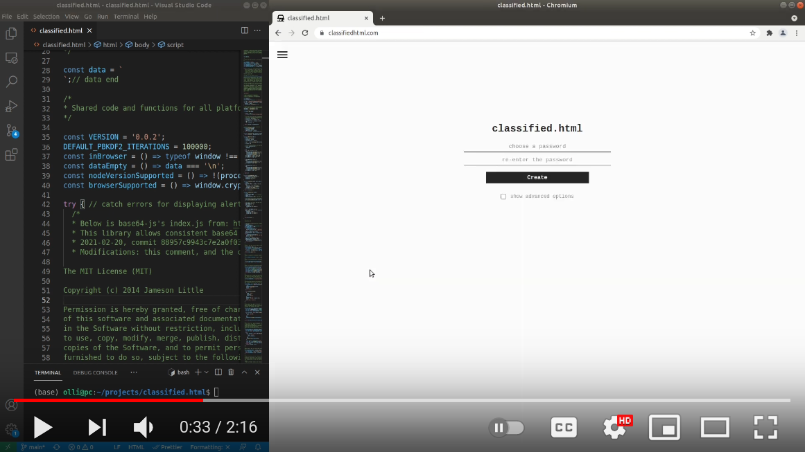

# classified.html

classified.html is a portable encryption solution with some unique features:
- Everything is contained into a single .html file, including the data → easy to backup, move and share
- For all major platforms: This single file can be accessed both from the browser and terminal with NodeJS (this means that `classified.html` is a legit HTML and JavaScript file at the same time!)

Other features:
- Uses efficient and well tested cryptographic implementations through [Web Crypto API](https://developer.mozilla.org/en-US/docs/Web/API/Web_Crypto_API)
- No external dependencies, works fully offline
- 256-bit AES-GCM encryption with PBKDF2 password key derivation function offers protection against brute forcing the password
- Both PC and mobile browser support (on mobile only Chrome on Android has been well tested)

To start using: choose a password, write text and click save. This saves the text and the website encrypted into a single file, which can be accessed offline.

To test this go to [online demo](https://classifiedhtml.com). Other option is to download and open `classified.html` in browser or open with NodeJS by running `node classified.html`.

## Advanced use

Supported terminal commands can be found out by running `node classified.html --help`.

Note that these commands can be passed as commandline arguments, for example: `node classified.html show row mysecret`, or after opening the file `node classified.html` + `show row mysecret`.

## Security
TLDR: this is mainly a concept which might have security issues and/or corrupt the data, for critical information I'd recommend [KeePass](https://keepass.info/) for proper offline encryption
- If this concept is implemented properly, as far as I know the browser side should be quite secure if you assume that you dont have any malicious keylogging programs or browser extensions
- When opened in terminal, the program attempts to clear all shown secrets after use, but this data might be accessible through some means on some platforms

If you have any concerns, comments or improvements to the security side, I'm eager to hear them, please for example create new Issue or PR

## Key learnings

- Hard to make work on browser and Nodejs at same time, but possible:
    - built in base64 encode/decode on browsers and NodeJS did not seem to be compatible → [base64-js](https://github.com/beatgammit/base64-js/blob/master/index.js) was included into source to make sure there are no compatibility issues with different platforms
    - Browser does not have a interface to return unmodified html source (`document.documentElement.innerHTML` does not work for example), which is required for saving → as much as possible hes been inserted inside `<script>` tags, such as HTML and CSS sources 
- iPhone Safari does not open individual .html files :(

## Known bugs and issues

- Android Firefox scales text page wrong for some reason (also start page if rotated landsape and then portrait)
- iPhone Safari does not work with the current setup, for example: it does not allow opening downloaded files

## Development

Please create issues/PRs if you have any bugs reports or improvements to the current state. New features might not be accepted as this concept currently aims to be as simple as possible.

`classified.html` is generated automatically by running npm scripts inside src/, more info at [src/DEVELOPMENT.md](./src/DEVELOPMENT.md)

## Credits

- [base64js](https://github.com/beatgammit/base64-js) handles base64 encoding/decoding so it works the same way on all platforms
- [material-desingn-icons](https://github.com/google/material-design-icons) is the source for menu and exit icons used in the project
- [minimal-password-prompt](https://www.npmjs.com/package/minimal-password-prompt) my other side project, which is used to read passwords on NodeJS in this project also
